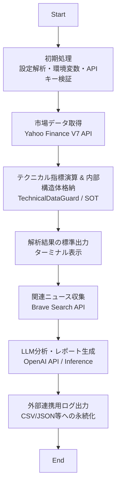

# 設計・開発思想 (Design Philosophy)

Tickwiseの開発における背景、設計判断、および将来のビジョンについての記録です。

## 1. 開発の動機：ハルシネーションの克服
金融分析におけるAI（LLM）の活用には、「もっともらしい嘘（ハルシネーション）」という大きな課題があります。
Tickwiseは、LLMに「生の推測」をさせるのではなく、**「検証済みの客観的データ」をコンテキストとして提供する**ことで、分析の信頼性を根本から高めることを目的として設計されました。

- **Truth over Guesswork**: テクニカル指標の計算をLLMに任せず、Rustによる厳密な数値計算によって裏付けられたデータのみを渡します。
- **Objective Analysis**: 感情やバイアスを排した、純粋な数値データに基づいた論理的な推論をAIから引き出します。

## 2. 実行フローチャート (Runtime Flow)
Tickwiseのメインプロセスは以下のフローで進行します。システム全体を俯瞰するためのロードマップです。

## 3. 設定の初期化と優先順位 (Initialization Hierarchy)
フローチャートの「初期処理」にあたるフェーズです。Tickwiseは数十種類に及ぶコマンドオプションを持ちますが、これらを独自の優先順位に基づいて破綻なく処理しています。この複雑なパースとバリデーションを強力にサポートしているのが、Rustの **`clap` クレート** です。

### 三段階の優先順位とclapの役割
設定値は以下の順序で評価され、より上位層が下位層を上書きします。

1.  **Command-Line Options (最優先)**: 実行時の状況に応じた一時的な変更。`clap` による宣言的な定義により、型安全な解析とヘルプ画面の自動生成を実現しています。
2.  **`tickwise.env` (環境設定ファイル)**: ユーザー固有の「いつもの」設定。ファイルから読み込まれた値は、コマンドオプションが指定されていない場合にのみ適用されます。
3.  **Hardcoded Defaults (既定値)**: ツールとしての標準的な挙動。`clap` の `default_value` 機能を活用し、明示的な設定がない場合でも安定した初期状態を保証します。

`clap` がなければ、この膨大なオプションを手動で管理することは困難であり、エラーの温床になっていたはずです。この抽象化層により、開発者はドメインロジックの開発に集中できる環境が整っています。

### -I (--no-env-indicators) オプションの役割
Tickwiseには、`.env` ファイルに記述されたインジケーター設定（閾値、重み付けなど）を**あえて無視して既定値で動かす** `-I` オプションが存在します。
これは、「個別にカスタマイズした設定では判断が偏っているかもしれない」と感じた際に、ツール標準の「客観的な視点」にワンタッチで立ち返るための**キャリブレーション機能**として設計されています。

## 4. アーキテクチャの核心：SOT (Source of Truth)
フローチャートの「指標演算 & 内部構造体格納」にあたる、設計上の最重要コンセプトです。

### TechnicalDataGuard：不変性と開発者への補助
取得したデータや計算結果をセキュアにカプセル化し、不正な書き換えを防ぎつつ、必要な場所へ一貫したデータを提供します。

- **意図的な制限**: `TechnicalDataGuard` は内部データへの直接アクセスを制限します。これは単なる「禁止」ではなく、**「ミスが不可能な構造」を設計レベルで提供する**ためのものです。
- **開発効率の向上**: データの整合性をガードが保証することで、開発者は「他の個所でデータが改ざんされていないか」を心配する必要がありません。これにより、コードレビューの負担が軽減され、大規模なリファクタリング時でもロジックの破綻を早期に防ぐことができます。

### Security-First
金融データやAPIキーを扱う性質上、`zeroize` クレートによるメモリのサニタイズなど、メモリ安全性に妥当な対価を払っています。

## 5. 非同期処理 (`tokio`) の採用理由
現在の `main` 関数のロジックは、株価取得からLLM解析までシーケンシャル（逐次実行）に進みます。それにもかかわらず `tokio` による非同期ランタイムを採用しているのには、2つの大きな理由があります。

### エコシステムへの適合
現代のRustにおける主要なネットワークI/Oライブラリ（`reqwest` 等）は非同期実行を前提としています。これらを標準的な作法で扱うことで、コードの可読性と保守性を維持しています。

### 将来の「並列比較」への布石
単一銘柄の分析であればOSレベルの並列化（プロセスの多重起動）で十分ですが、アプリケーション内で非同期ランタイムを持つ真の価値は、**銘柄間の相関分析や比較**にあります。将来的に複数の非同期タスクを一つのコンテキストで制御するための基盤として `tokio` を選択しています。

## 6. ツールとしての立ち位置
フローチャートの後半、ユーザーに価値を届ける「標準出力」や「レポート生成」に関わる思想です。

- **Flexibility**: CLIオプションによる高度なカスタマイズ性。
- **Transparency**: どのような計算が行われたか、どのようなニュースが参照されたかをユーザーが常に追跡可能であること。

## 7. 主要アップデート (v1.1)
v1.1では、実用性と堅牢性をさらに高めるための重要な改修が行われました。

- **キャリブレーション機能 (-I オプション)**: 環境設定ファイルを無視し、即座にツール既定値での分析に切り替える機能を追加。
- **市場時間への完全対応**: システムのローカル(リアルタイム)時刻ではなく、対象市場の取引時間に準拠した正確な時間枠での解析を実現。
- **ログ出力の強化**: CSV/JSON連携において、解析実行時のタイムスタンプ項目を追加し、時系列データとしての活用性を向上。
- **APIキー・セキュリティの極大化**: プロセス起動時の読み込みを廃止し、使用直前のオンデマンド取得と `zeroize` によるメモリ完全消去（0パディング）を徹底。
- **内部処理の軽量化**: 不要な中間ファイルの生成を廃止し、メモリ内処理とストリーム出力による高速化とクリーンな実行環境を確立。
- **LLMプロンプトの最適化**: ニュースとテクニカル指標のコンテキスト結合をより自然かつ論理的に再構成し、解析レポートの品質を向上。

## 8. 技術的負債と次期ロードマップ：モジュール化への移行
現在のバージョン1.1までは、開発スピードと論理的な一貫性を最優先し、あえて `main.rs` という単一の巨大なファイル構造（約4,600行）を維持する選択をしました。

しかし、解析機能の追加に伴いコードベースが膨大化しており、単一ファイルでの管理は限界に達しています。次期バージョン以降では、「関心の分離（SoC）」をさらに推し進めるため、以下のモジュール分割を予定しています。

- **`config`**: 引数パースと環境変数管理の分離
- **`market`**: 株価・ニュース取得ロジックの独立
- **`technical`**: テクニカル指標計算エンジンのモジュール化
- **`llm`**: LLMプロンプト生成とAPI連携の集約

このリファクタリングにより、テスタビリティ（テストのしやすさ）を向上させ、さらなる高度な分析機能の追加に対応できる柔軟な基盤へと進化させます。

この設計思想は、今後の新機能実装やリファクタリングにおいても、全ての判断の指針となります。

---

## 🔗 関連ドキュメント
- [Security_Design.md](./Security_Design.md) - セキュリティとデータの完全性に関する詳細
- [why-tickwise-rust.md](./why-tickwise-rust.md) - なぜRustを採用したのか
